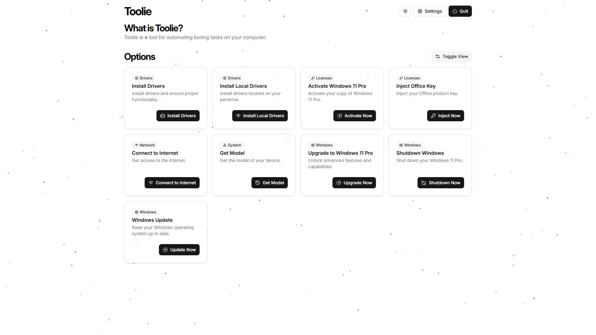

# Toolie

A comprehensive Windows system management tool that provides automated driver installation, network connectivity, system updates, and more through an intuitive GUI interface.

## Features

- **🔧 Driver Management**: Automated installation of both local and remote drivers
- **🌐 Network Configuration**: WiFi connection management and configuration
- **📱 Modern UI**: Clean, responsive interface built with React and Tailwind CSS
- **🎯 System Information**: Device model detection and system details
- **🔄 Windows Updates**: Automated Windows Update management
- **⚡ Performance**: Fast, lightweight desktop application powered by PyWebView

## Screenshots

### Dark Theme


_Grid View_


_Table View_

### Light Theme


_Grid View_


_Table View_

## Installation

### Prerequisites

- Python 3.8+
- Node.js 16+
- Windows 10/11

### Quick Start

1. **Clone the repository**

   ```bash
   git clone https://github.com/DawidGawronskiDev/toolie.git
   cd toolie
   ```

2. **Set up Python environment**

   ```bash
   python -m venv .venv
   .venv\Scripts\activate
   pip install pywebview pyinstaller
   ```

3. **Configure settings**
   Create `utils/Settings.py`:

   ```python
   class Settings:
       def __init__(self):
           self.settings = {
               "internet": {
                   "ssid": "Your-WiFi-SSID",
                   "password": "Your-WiFi-Password"
               },
               "drivers": {
                   "remote_drivers_path": "path/to/your/drivers"
               }
           }
   ```

4. **Install frontend dependencies**

   ```bash
   cd gui
   npm install
   npm run build
   cd ..
   ```

5. **Run the application**
   ```bash
   python main.py
   ```

## Development

### Development Setup

1. **Start the frontend in development mode**

   ```bash
   cd gui
   npm run dev
   ```

2. **Run the Python backend**
   ```bash
   python main.py
   ```

### Project Structure

```
toolie/
├── main.py                 # Application entry point
├── utils/                  # Python utilities
│   ├── API.py             # PyWebView API interface
│   ├── System.py          # System information utilities
│   ├── Internet.py        # Network management
│   └── Drivers.py         # Driver installation
├── gui/                   # React frontend
│   ├── src/
│   ├── dist/              # Built frontend files
│   └── package.json
├── config/
│   └── settings.json      # Application configuration
└── drivers/               # Driver storage directory
```

## Building

### Create Production Build

```bash
# Build frontend
cd gui
npm run build
cd ..

# Create executable
pyinstaller --noconsole --onefile \
  --add-data "gui/dist;gui/dist" \
  --add-data "config/settings.json;config/settings.json" \
  main.py
```

The executable will be created in the `dist/` directory.

## Configuration

### Settings File

The application uses `config/settings.json` for configuration:

```json
{
  "internet": {
    "ssid": "<SSID>",
    "password": "<PASSWORD>"
  },
  "drivers": {
    "remote_drivers_path": "<REMOTE_DRIVERS_PATH>"
  }
}
```

### Driver Organization

Place drivers in the following structure:

```
drivers/
├── ModelName1/
│   ├── driver1.exe
│   └── driver2.exe
└── ModelName2/
    └── driver.exe
```

## Technology Stack

### Backend

- **Python 3.8+**: Core application logic
- **PyWebView**: Desktop GUI framework
- **Windows APIs**: System integration

### Frontend

- **React 18**: User interface framework
- **TypeScript**: Type-safe JavaScript
- **Tailwind CSS**: Utility-first CSS framework
- **Vite**: Fast build tool and dev server
- **Shadcn/ui**: Modern UI components

## Contributing

1. Fork the repository
2. Create your feature branch (`git checkout -b feature/amazing-feature`)
3. Commit your changes (`git commit -m 'Add some amazing feature'`)
4. Push to the branch (`git push origin feature/amazing-feature`)
5. Open a Pull Request

## License

This project is licensed under the MIT License - see the [LICENSE](LICENSE) file for details.

## Support

If you encounter any issues or have questions:

- Create an [issue](https://github.com/DawidGawronskiDev/toolie/issues)
- Check existing [discussions](https://github.com/DawidGawronskiDev/toolie/discussions)

---

**Made with ❤️ by [Dawid Gawroński](https://github.com/DawidGawronskiDev)**
